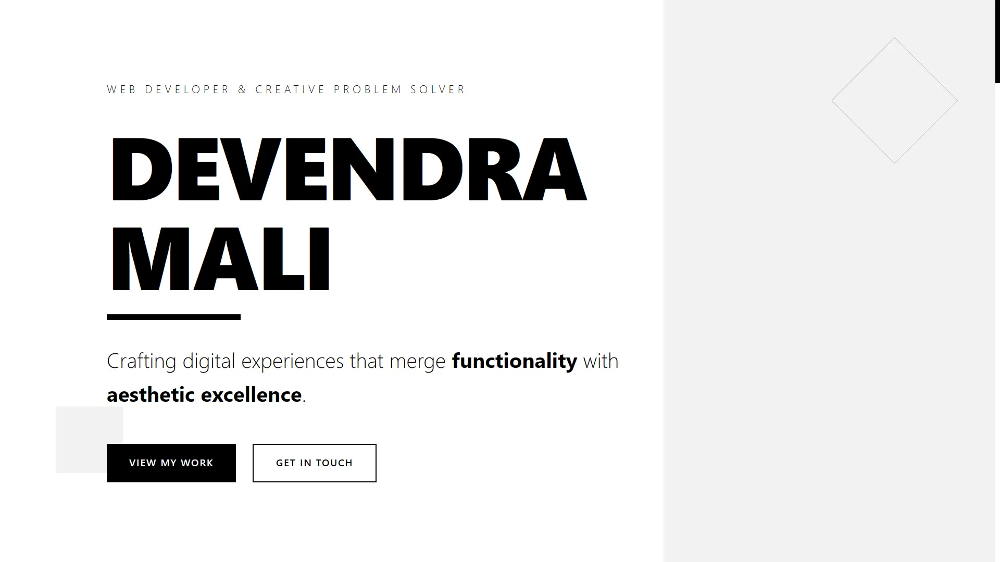

# Devendra Mali - Portfolio Website

A modern, bold, and minimalist portfolio website showcasing my projects and skills as a Full Stack Developer and Information Technology student.



## 🌟 Features

- **Bold Editorial Design** - Black and white color scheme with large, striking typography
- **Dynamic Project Case Studies** - Individual pages for each project with detailed breakdowns
- **Smooth Animations** - Staggered fade-in effects and interactive hover transitions
- **Responsive Design** - Optimized for desktop, tablet, and mobile devices
- **Contact Form Integration** - Working contact form with EmailJS
- **Google Analytics** - GA4 event tracking for user insights
- **SEO Optimized** - Complete meta tags, sitemap, and robots.txt
- **Accessible** - WCAG 2.1 compliant with keyboard navigation
- **Performance Optimized** - Code splitting, lazy loading, and minification
- **404 Error Page** - Custom error page for better UX
- **Back to Top Button** - Easy navigation on long pages
- **Fast Performance** - Optimized loading times and smooth navigation

## 🛠️ Tech Stack

- **Frontend:** React 19.1.1
- **Routing:** React Router DOM 7.9.3
- **Styling:** Tailwind CSS 4.1.13
- **Build Tool:** Vite 7.1.2
- **Contact Forms:** EmailJS
- **Analytics:** Google Analytics GA4
- **Code Quality:** ESLint

## 📂 Project Structure

```
DevendraMali/
├── public/
│   └── assets/          # Project images and assets
├── src/
│   ├── components/      # React components
│   │   ├── Hero.jsx
│   │   ├── About.jsx
│   │   ├── Projects.jsx
│   │   └── Contact.jsx
│   ├── pages/           # Page components
│   │   ├── Home.jsx
│   │   └── CaseStudy.jsx
│   ├── data/            # Project data
│   │   └── projectsData.js
│   ├── App.jsx          # Main app component with routing
│   ├── main.jsx         # Entry point
│   └── index.css        # Global styles
├── index.html
├── package.json
├── vite.config.js
└── README.md
```

## 🚀 Getting Started

### Prerequisites

- Node.js (v18 or higher)
- npm or yarn

### Installation

1. Clone the repository
```bash
git clone https://github.com/Dev-5804/devendra-mali.git
cd devendra-mali
```

2. Install dependencies
```bash
npm install
```

3. Create `.env` file in the root directory
```bash
VITE_GA_MEASUREMENT_ID=your_google_analytics_id
VITE_EMAILJS_SERVICE_ID=your_service_id
VITE_EMAILJS_TEMPLATE_ID=your_template_id
VITE_EMAILJS_PUBLIC_KEY=your_public_key
```

4. Set up EmailJS
   - Create an account at [EmailJS](https://www.emailjs.com/)
   - Get your Service ID, Template ID, and Public Key
   - Add them to your `.env` file

5. Set up Google Analytics (Optional)
   - Create a GA4 property at [Google Analytics](https://analytics.google.com/)
   - Add your Measurement ID to `.env`

6. Start the development server
```bash
npm run dev
```

7. Open your browser and visit `http://localhost:5173`

## 📜 Available Scripts

- `npm run dev` - Start development server
- `npm run build` - Build for production
- `npm run preview` - Preview production build
- `npm run lint` - Run ESLint
- `npm run generate-sitemap` - Generate sitemap.xml from project data

## 🎨 Sections

1. **Hero** - Eye-catching introduction with animated name and tagline
2. **About** - Background, skills, and stats
3. **Projects** - Portfolio showcase with asymmetric masonry grid
4. **Contact** - Contact form and social links

## 📱 Featured Projects

- **ClearSite** - Construction waste management booking platform
- **MFraming Pixel** - Photographer portfolio with headless CMS
- **ModEdge Interior** - Interior design portfolio website
- **Menteronics** - Educational platform for offline courses
- **Personal Portfolio** - This website

## 🔗 Connect With Me

- **Email:** dev.endra.mali.5804@gmail.com
- **GitHub:** [Dev-5804](https://github.com/Dev-5804/)
- **LinkedIn:** [dev-endra-mali](https://www.linkedin.com/in/dev-endra-mali/)
- **Twitter/X:** [@Devendr98554068](https://x.com/Devendr98554068)
- **Instagram:** [@_devendra_mali](https://www.instagram.com/_devendra_mali/)

## 📄 License

This project is open source and available under the [MIT License](LICENSE).

## 🙏 Acknowledgments

- Design inspiration from modern editorial layouts
- Built with React and Tailwind CSS
- Deployed with Vite

---

**© 2025 Devendra Mali. All rights reserved.**
